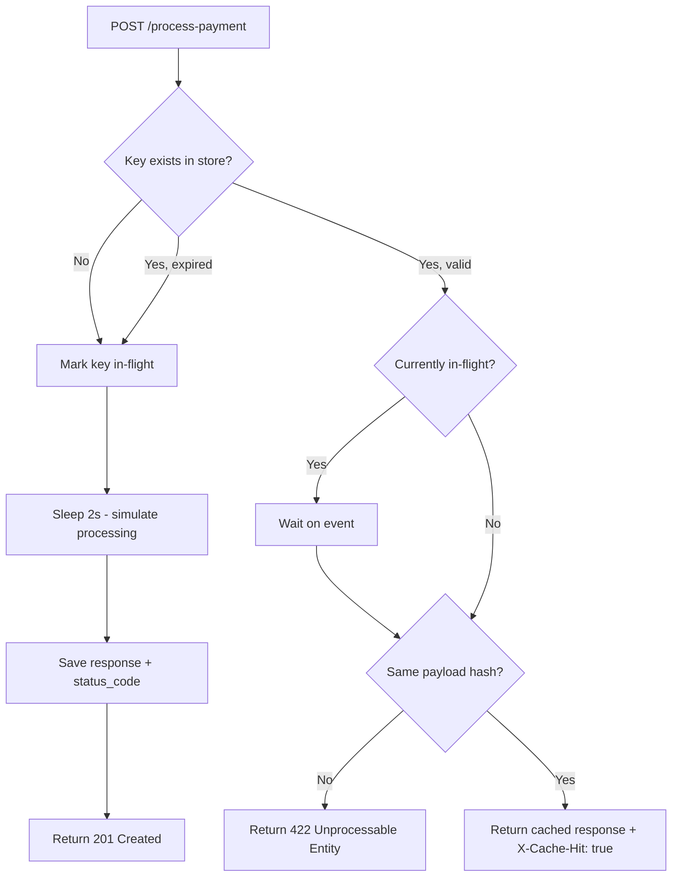
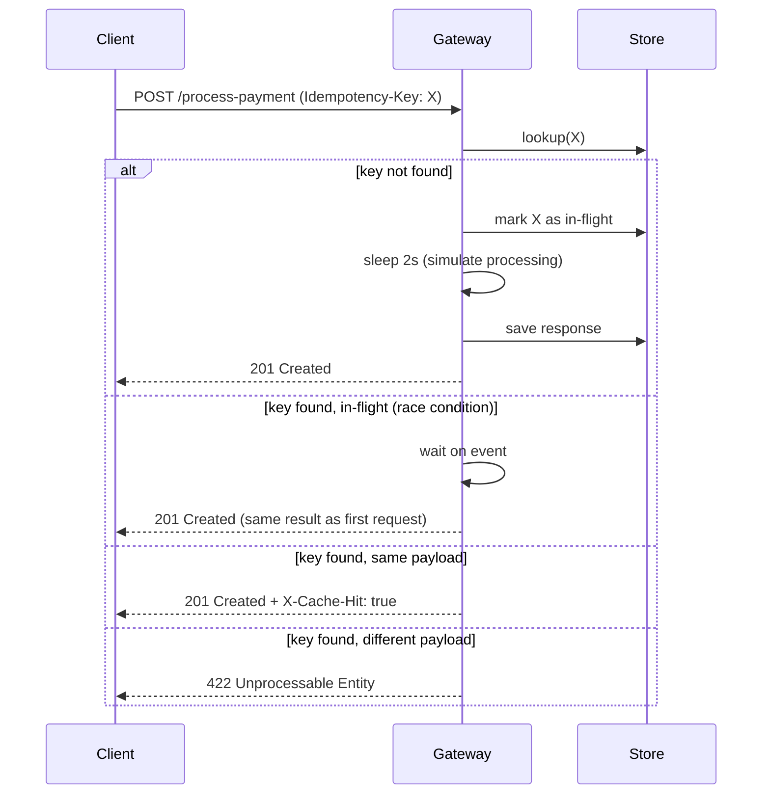

# Idempotency Gateway — FinSafe Transactions Ltd.

A Python/FastAPI backend service that guarantees payments are processed **exactly once**, no matter how many times the client retries.

---

## 1. Architecture Diagram

**Decision flowchart:**



**Sequence diagram:**



---

## 2. Setup Instructions

**Requirements:** Python 3.8+

```bash
# 1. Clone the repository
git clone <your-repo-url>
cd Idempotency-gateway

# 2. Create and activate virtual environment
python -m venv venv

# Windows
venv\Scripts\activate

# Mac/Linux
source venv/bin/activate

# 3. Install dependencies
pip install -r requirements.txt

# 4. Start the server
uvicorn main:app --reload
```

Server runs at: `http://127.0.0.1:8000`

---

## 3. API Documentation

### POST `/process-payment`

Processes a payment exactly once for a given `Idempotency-Key`.

**Request Headers:**

| Header | Required | Description |
|---|---|---|
| `Idempotency-Key` | Yes | Unique string identifying this payment request |
| `Content-Type` | Yes | Must be `application/json` |

**Request Body:**

```json
{
  "amount": 100,
  "currency": "GHS"
}
```

**Responses:**

| Status | When | Body |
|---|---|---|
| `201 Created` | First successful request | `{ "message": "Charged 100 GHS", "transaction_id": "...", "status": "success" }` |
| `201 Created` + `X-Cache-Hit: true` | Duplicate request (same key + same body) | Same body as first response |
| `422 Unprocessable Entity` | Same key, different body | `{ "detail": "Idempotency key already used for a different request body." }` |

**Example — First Request:**

```bash
curl -X POST http://127.0.0.1:8000/process-payment \
  -H "Content-Type: application/json" \
  -H "Idempotency-Key: key-001" \
  -d '{"amount": 100, "currency": "GHS"}'
```

Response (after 2 seconds):
```json
{
  "message": "Charged 100 GHS",
  "transaction_id": "txn_key-001",
  "status": "success"
}
```

**Example — Duplicate Request (same key, same body):**

Same request sent again → returns instantly with header `X-Cache-Hit: true`.

**Example — Conflict (same key, different body):**

```bash
curl -X POST http://127.0.0.1:8000/process-payment \
  -H "Content-Type: application/json" \
  -H "Idempotency-Key: key-001" \
  -d '{"amount": 500, "currency": "GHS"}'
```

Response:
```json
{
  "detail": "Idempotency key already used for a different request body."
}
```

---

### GET `/health`

Returns server status and number of stored keys.

```json
{ "status": "ok", "stored_keys": 1 }
```

---

## 4. Design Decisions

### In-memory store (dict)
Chosen for simplicity and speed. In a production system this would be replaced with Redis for persistence across restarts and horizontal scaling.

### SHA-256 payload hashing
Instead of storing the full request body, we store a SHA-256 fingerprint. This is memory-efficient and makes comparison O(1) regardless of payload size.

### asyncio.Event for race conditions
When two identical requests arrive simultaneously, the second request waits on an `asyncio.Event` instead of starting a new process. Once the first request finishes, it signals the event and the second request reads the cached result. This prevents double-charging under concurrent load.

### Payload hash uses sorted keys
`json.dumps(payload, sort_keys=True)` ensures `{"amount":100,"currency":"GHS"}` and `{"currency":"GHS","amount":100}` produce the same hash, avoiding false conflicts from key ordering differences.

---

## 5. Developer's Choice — Key Expiration (TTL)

**Feature:** Idempotency keys automatically expire after **24 hours**.

**Why:** In a real Fintech system, idempotency keys should not be stored forever. A key from last month should not block a legitimate new payment with the same ID. Setting a 24-hour TTL:
- Prevents unbounded memory growth
- Matches industry standards (Stripe uses 24 hours)
- Allows key reuse after a reasonable time window

**How it works:** Every entry stores a `timestamp` when it was first created. On each request, if the key exists but `(current_time - timestamp) > 86400 seconds`, the entry is deleted and the request is treated as new.

---

## Pre-Submission Checklist

- [x] Repository is set to **Public**
- [x] `venv/` and `__pycache__/` excluded via `.gitignore`
- [x] Server starts with `uvicorn main:app --reload`
- [x] Architecture diagram included
- [x] Original instructions replaced with this documentation
- [x] API endpoints documented with examples
- [x] Multiple meaningful commits in git history
